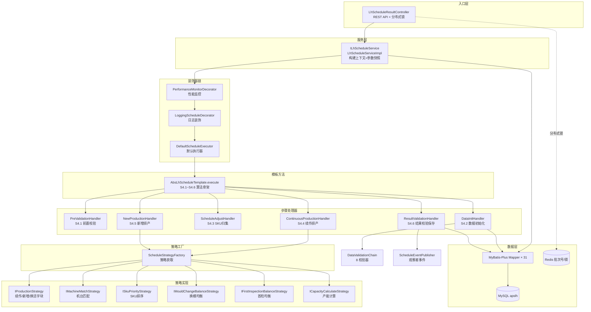
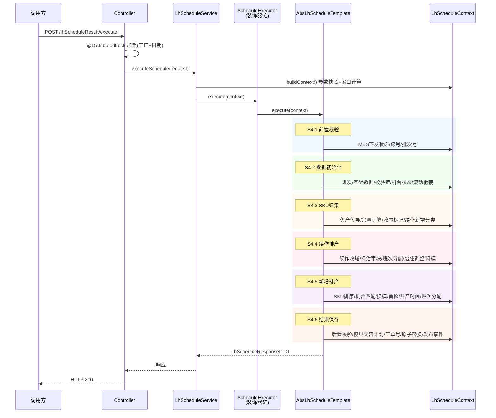
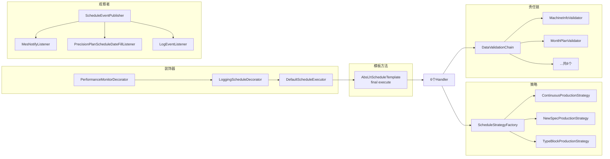
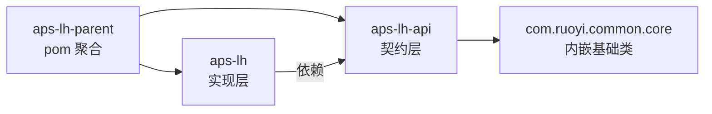

# aps-lh-parent 项目知识库

> 硫化排程系统（APS - Vulcanization Scheduling）完整开发参考
> 适用范围：开发、排障、二次开发、代码导航
> 生成时间：2026-06-15

---

## 目录

- [1. 项目概述](#1-项目概述)
- [2. 技术栈](#2-技术栈)
- [3. 目录结构](#3-目录结构)
- [4. 架构图](#4-架构图)
- [5. 模块依赖](#5-模块依赖)
- [6. 核心文件/类/函数说明](#6-核心文件类函数说明)
- [7. API 接口清单](#7-api-接口清单)
- [8. 全局符号索引（定义+调用链）](#8-全局符号索引定义调用链)

---

## 1. 项目概述

**aps-lh-parent** 是面向轮胎制造硫化车间的 **APS（Advanced Planning and Scheduling，高级排程）系统**，专注于硫化工序的自动化排产。

### 业务定位

| 维度 | 说明 |
|------|------|
| 行业 | 轮胎制造 - 硫化工序 |
| 核心能力 | 月计划→日计划分解、机台-模具-胎胚-SKU 多维匹配、滚动排程 |
| 工厂 | 116-越南 / 117-泰国（见 `FactoryCodeEnum`） |
| 排程窗口 | T～T+2 三天 8 班次（默认 `SCHEDULE_DAYS=3`） |
| 关键产物 | 硫化排程结果、未排结果、模具交替计划、排程日志 |

### 核心业务概念

| 概念 | 说明 |
|------|------|
| 月计划 | `FactoryMonthPlanProductionFinalResult`，月级生产计划总量，按 day1~day31 分日 |
| 日计划账本 | `SkuDailyPlanQuotaDTO`，排程窗口内每日额度（remaining/scheduled/cumulative） |
| 硫化余量 | `MAX(月计划总量 - 已完成量, 0)`，决定是否继续排产 |
| 续作 | MES 在机/滚动继承的规格继续排产（S4.4，`ScheduleTypeEnum.CONTINUOUS`） |
| 新增 | 新规格首次上机排产（S4.5，`ScheduleTypeEnum.NEW_SPEC`） |
| 换活字块 | 同胎胚同模具规格切换（S4.4，`ScheduleTypeEnum.TYPE_BLOCK`） |
| 换模 | 模具切换，受每日上限约束（早≤8 / 中≤7 / 总≤15） |
| 收尾 | 3 天内可完成的 SKU 标记为 `ENDING`，优先排产 |
| 滚动排程 | 前批次重叠班次继承到本次（`RollingScheduleHandoffService`） |
| 胎胚库存分摊 | 同胎胚多 SKU 按标准产能占比分配库存 |
| 开停产管控 | 按比例（50%/70%/80%/90%）调整班次产能 |

---

## 2. 技术栈

| 类别 | 技术 | 版本 |
|------|------|------|
| 语言 | Java | 8 |
| 构建 | Maven 多模块 | - |
| 框架 | Spring Boot | 2.7.18 |
| ORM | MyBatis-Plus | 3.5.3 |
| 数据库 | MySQL | 8.0.33（库名 `apslh`，utf8mb4） |
| 缓存 | Redis + Lettuce | 6.2.7 |
| 分布式锁 | Redisson | 3.17.7 |
| 接口文档 | Springfox + Knife4j | 2.10.5 / 2.0.9 |
| 工具库 | Hutool | 5.8.25 |
| 工具库 | Apache Commons Lang3 | 3.20.0 |
| 简化代码 | Lombok | 1.18.16 |
| 基础 Web 基类 | RuoYi `com.ruoyi.common.core` | 内嵌 |

**启动端口**：9669  
**访问前缀**：`/lhScheduleResult`

---

## 3. 目录结构

```
aps-lh-parent/                          # 父 POM 聚合工程
├── pom.xml                             # 父 POM，统一依赖版本管理
├── AGENTS.md                           # 项目开发规范（必读）
├── DESIGN.md                           # 架构设计文档
├── aps-lh-api/                         # 【契约层】对外 API：domain/entity/enum/constant
│   └── src/main/java/
│       ├── com/ruoyi/common/core/      # RuoYi 基础 Web 基类（BaseEntity/AjaxResult）
│       └── com/zlt/aps/
│           ├── lh/api/                 # 硫化排程契约
│           │   ├── domain/dto/         # DTO（LhScheduleRequestDTO 等 13 个）
│           │   ├── domain/entity/      # 实体（LhScheduleResult 等 16 个）
│           │   ├── domain/vo/          # VO（LhShiftConfigVO）
│           │   ├── enums/              # 枚举（23 个）
│           │   └── constant/           # 常量（3 个）
│           ├── mdm/api/domain/entity/  # 主数据实体（8 个：物料/机型/工作日历等）
│           ├── mp/api/domain/entity/   # 月计划实体（6 个）
│           └── cx/api/domain/entity/   # 库存实体（CxStock）
└── aps-lh/                             # 【实现层】主服务
    └── src/main/java/com/zlt/aps/lh/
        ├── controller/                 # ★ 接口入口（LhScheduleResultController）
        ├── service/                    # 业务服务接口（7 个）
        │   └── impl/                   # 业务服务实现（9 个）
        ├── handler/                    # ★ S4.x 步骤处理器（7 个）
        ├── engine/                     # ★ 排程引擎核心
        │   ├── template/               # 模板方法（2 个）
        │   ├── decorator/              # 装饰器（6 个）
        │   ├── strategy/               # 策略模式
        │   │   ├── I*.java             # 策略接口（11 个）
        │   │   ├── impl/               # 策略实现（13 个）
        │   │   └── support/            # 策略支撑类（13 个）
        │   ├── chain/                  # 责任链校验
        │   │   ├── IDataValidator.java
        │   │   ├── DataValidationChain.java
        │   │   └── validators/         # 校验器实现（8 个）
        │   ├── factory/                # 策略工厂（ScheduleStrategyFactory）
        │   └── observer/               # 观察者（事件发布+3 监听器）
        ├── context/                    # ★ 排程上下文（数据总线）
        ├── mapper/                     # MyBatis Mapper（31 个）
        ├── component/                  # 组件（批次号生成/索引/守卫等 7 个）
        ├── config/                     # 配置（4 个）
        ├── exception/                  # 异常体系（3 个）
        ├── util/                       # 工具类（21 个）
        └── redissonLock/               # 分布式锁注解+切面
    └── src/main/resources/
        ├── application.yml             # 应用配置
        ├── logback-spring.xml          # 日志配置
        ├── mapper/lh/                  # MyBatis XML（4 个复杂查询）
        └── sql/                        # 初始化 SQL
```

---

## 4. 架构图

### 4.1 整体分层架构



### 4.2 排程主流程时序（S4.1～S4.6）



### 4.3 引擎设计模式组合



---

## 5. 模块依赖

### 5.1 Maven 模块依赖



### 5.2 核心类依赖关系

| 消费方 | 被依赖（生产方） | 依赖类型 |
|--------|------------------|----------|
| `LhScheduleResultController` | `ILhScheduleService` | 接口注入 |
| `LhScheduleServiceImpl` | `IScheduleExecutor`(装饰器链), `LhScheduleConfigResolver`, `LhScheduleResultMapper`, `ScheduleEventPublisher` | 字段注入 |
| `LhScheduleTemplateImpl` | 6 个 `AbsScheduleStepHandler` | 字段注入 |
| `DataInitHandler` | `DataValidationChain`, `ILhBaseDataService`, `ILhShiftConfigService`, `RollingScheduleHandoffService`, `IProductionShutdownStrategy` | 字段注入 |
| `ContinuousProductionHandler` / `NewProductionHandler` | `ScheduleStrategyFactory` | 字段注入 |
| `ScheduleStrategyFactory` | 11 个策略接口实现（自动收集 `IProductionStrategy` 列表） | 自动注册 |
| `DataValidationChain` | `List<IDataValidator>`（8 个校验器） | 自动收集 |

---

## 6. 核心文件/类/函数说明

### 6.1 入口与服务层

| 文件 | 核心类/方法 | 职责 |
|------|-------------|------|
| `controller/LhScheduleResultController.java` | `executeSchedule()` / `publishSchedule()` | REST 入口，`@DistributedLock` 防并发 |
| `service/ILhScheduleService.java` | `executeSchedule()` / `publishSchedule()` | 排程服务接口 |
| `service/impl/LhScheduleServiceImpl.java` | `buildContext()` | 构建上下文：参数快照、窗口计算（T日=目标日-(天数-2)） |
| `service/impl/LhBaseDataServiceImpl.java` | `loadAllBaseData()` | 加载月计划/机台/模具/库存等全部基础数据 |
| `service/impl/SchedulePersistenceService.java` | `replaceScheduleAtomically()` | 目标日结果原子替换（事务） |
| `service/impl/RollingScheduleHandoffService.java` | `apply()` | 滚动排程前批次重叠班次继承 |

### 6.2 排程引擎核心

#### 模板方法（`engine/template`）

| 类 | 核心方法 | 说明 |
|----|----------|------|
| `AbsLhScheduleTemplate` | `final execute(context)` | **算法骨架**：S4.1→S4.6 不可变顺序，统一异常/中断/日志处理 |
| `LhScheduleTemplateImpl` | `doPreValidation/doDataInitialization/...` | 绑定 6 个 Handler 到抽象步骤 |

#### 装饰器（`engine/decorator`）

| 类 | 说明 |
|----|------|
| `IScheduleExecutor` | 执行器接口 |
| `DefaultScheduleExecutor` | 默认实现，委托模板 |
| `AbsScheduleExecutorDecorator` | 装饰器基类，持有 `delegate` |
| `LoggingScheduleDecorator` | 日志装饰 |
| `PerformanceMonitorDecorator` | 性能监控装饰 |
| `ScheduleExecutorConfig` | `@Configuration` 组装链：`Performance → Logging → Default` |

#### 步骤处理器（`handler`）

| 类 | 步骤 | 核心子步骤 |
|----|------|-----------|
| `AbsScheduleStepHandler` | 基类 | `handle()` 统一前置/异常/耗时处理 |
| `PreValidationHandler` | **S4.1** | MES下发校验、跨月校验、生成批次号 |
| `DataInitHandler` | **S4.2** | 班次解析、基础数据加载、校验链、机台状态初始化、滚动衔接 |
| `ScheduleAdjustHandler` | **S4.3** | 欠产归集、SKU按结构归集、收尾标记、共用胎胚零余量剔除、续作/新增分类 |
| `ContinuousProductionHandler` | **S4.4** | 续作收尾、换活字块、班次分配、胎胚调整、降模 |
| `NewProductionHandler` | **S4.5** | SKU排序、机台匹配、换模、首检、开产时间、班次分配、降模 |
| `ResultValidationHandler` | **S4.6** | 后置校验、模具交替计划、工单号、示方历史保护、原子保存、发布事件 |

#### 策略（`engine/strategy`）

| 接口 | 默认实现 | 职责 |
|------|----------|------|
| `IProductionStrategy` | `ContinuousProductionStrategy` / `NewSpecProductionStrategy` | 排产主策略（按 `scheduleType` 注册） |
| `ITypeBlockProductionStrategy` | `TypeBlockProductionStrategy` | 换活字块衔接 |
| `IMachineMatchStrategy` | `DefaultMachineMatchStrategy` / `LocalSearchMachineAllocatorStrategy` | 机台匹配（含局部搜索） |
| `ISkuPriorityStrategy` | `DefaultSkuPriorityStrategy` | SKU 优先级排序 |
| `IMouldChangeBalanceStrategy` | `DefaultMouldChangeBalanceStrategy` | 换模均衡（早≤8/中≤7/总≤15） |
| `IFirstInspectionBalanceStrategy` | `DefaultFirstInspectionBalanceStrategy` | 首检均衡 |
| `ICapacityCalculateStrategy` | `DefaultCapacityCalculateStrategy` | 产能计算（保养/维修/清洗重叠） |
| `IEndingJudgmentStrategy` | `DefaultEndingJudgmentStrategy` | 收尾判定（3天/5天结构收尾） |
| `IProductionShutdownStrategy` | `DefaultProductionShutdownStrategy` | 开停产管控（50/70/80/90%） |
| `ITrialProductionStrategy` | `DefaultTrialProductionStrategy` | 试制/量试策略 |
| `IInsertOrderStrategy` | `DefaultInsertOrderStrategy` | 插单策略 |

#### 责任链校验（`engine/chain`）

| 校验器 | 校验内容 | 错误码 |
|--------|----------|--------|
| `MachineInfoValidator` | 机台信息完整性 | S4202 |
| `MonthPlanValidator` | 月计划数据 | S4203 |
| `WorkCalendarValidator` | 工作日历 | S4204 |
| `SkuCapacityValidator` | SKU 产能 | S4205 |
| `MouldRelationValidator` | SKU-模具关系 | S4206 |
| `SkuConstructionValidator` | SKU-示方书关系 | - |
| `SpecialMaterialBomValidator` | 特殊物料 BOM | - |
| `TrialFormulaValidator` | 试制示方书 | - |

> 校验策略：`COLLECT_ALL`（组内全跑聚合）/ `FAIL_FAST`（遇错即停），同组策略必须一致。

#### 观察者（`engine/observer`）

| 类 | 说明 |
|----|------|
| `ScheduleEvent` | 事件对象（`completed`/`failed`/`published`） |
| `ScheduleEventPublisher` | 发布器，遍历所有 `IScheduleEventListener` |
| `IScheduleEventListener` | 监听器接口（`supports` 过滤事件类型） |
| `MesNotifyListener` | 通知 MES（关注 COMPLETED/PUBLISHED） |
| `PrecisionPlanScheduleDateFillListener` | 回填精度保养计划排程日 |
| `LogEventListener` | 排程日志记录 |

### 6.3 上下文（`context`）

| 类 | 说明 |
|----|------|
| `LhScheduleContext` | **排程数据总线**，贯穿 S4.1~S4.6，含 80+ 字段：基本参数/硫化参数/基础数据/中间计算/机台分配状态/输出结果/流程控制 |
| `LhScheduleConfig` | 本次排程参数快照（`getParamValue`/`getParamIntValue`） |

**Context 关键方法**：
- `interruptSchedule(reason)` — 中断排程
- `addValidationError(msg)` — 追加校验错误
- `getParamValue(paramCode, default)` — 读硫化参数
- `removePendingSkuFromStructureMap(sku)` — 同步剔除结构分组
- `findSkuConstructionRef(materialCode, productStatus)` — 示方书降级匹配（S→T→X）

### 6.4 实体与 DTO

#### 核心实体（`aps-lh-api/domain/entity`）

| 实体 | 表 | 说明 |
|------|----|------|
| `LhScheduleResult` | `T_LH_SCHEDULE_RESULT` | **排程结果主表**，含班次槽位 class1~class8 |
| `LhUnscheduledResult` | `T_LH_UNSCHEDULED_RESULT` | 未排结果（含原因） |
| `LhMouldChangePlan` | `T_LH_MOULD_CHANGE_PLAN` | 模具交替计划 |
| `LhMachineInfo` | `T_LH_MACHINE_INFO` | 硫化机台信息 |
| `LhMachineOnlineInfo` | `T_LH_MACHINE_ONLINE_INFO` | MES 在机信息 |
| `LhParams` | `T_LH_PARAMS` | 硫化参数配置 |
| `LhShiftConfig` | `T_LH_SHIFT_CONFIG` | 班次配置 |
| `LhPrecisionPlan` | `T_LH_PRECISION_PLAN` | 精度保养计划 |
| `LhMouldCleanPlan` | `T_LH_MOULD_CLEAN_PLAN` | 模具清洗计划 |
| `LhSpecialMaterialBom` | `T_LH_SPECIAL_MATERIAL_BOM` | 特殊物料 BOM |
| `LhSpecifyMachine` | `T_LH_SPECIFY_MACHINE` | 定点机台 |
| `FactoryMonthPlanProductionFinalResult` | 月计划最终结果 | 月计划主数据 |
| `MdmMaterialInfo` / `MdmModelInfo` / `MdmSkuMouldRel` / `MdmSkuLhCapacity` / `MdmWorkCalendar` / `MdmMonthSurplus` / `MdmDevicePlanShut` / `MdmSkuConstructionRef` | MDM 主数据 | 物料/机型/SKU模具关系/产能/日历/余量/停机/示方 |

#### 核心 DTO

| DTO | 说明 |
|-----|------|
| `LhScheduleRequestDTO` | 请求：factoryCode/scheduleDate/monthPlanVersion/productionVersion/operator |
| `LhScheduleResponseDTO` | 响应：success/batchNo/统计数/validationErrors |
| `SkuScheduleDTO` | **SKU 排程对象**，含余量/待排量/目标量/日计划账本/优先级/施工阶段 |
| `MachineScheduleDTO` | 机台运行态：在产规格/停机/清洗/胶囊/班次可用 |
| `SkuDailyPlanQuotaDTO` | 日计划额度账本：dayPlanQty/scheduledQty/remainingQty/cumulativeQty |
| `ShiftRuntimeState` | 班次运行态 |
| `ShiftProductionControlDTO` | 班次排产管控 |
| `ValidationResult` | 校验结果 |

### 6.5 关键枚举（`aps-lh-api/enums`，共 23 个）

| 枚举 | 用途 |
|------|------|
| `ScheduleStepEnum` | 排程步骤 S4.1~S4.6 |
| `ScheduleTypeEnum` | 排程类型 01-续作/02-新增/03-换活字块 |
| `EventTypeEnum` | 事件类型 |
| `FactoryCodeEnum` | 工厂 116-越南/117-泰国 |
| `ConstructionStageEnum` | 施工阶段 S-正规/T-量试/X-试制 |
| `SkuTagEnum` | SKU 标签 NORMAL/ENDING |
| `ShiftEnum` | 班次 |
| `MachineStatusEnum` | 机台状态 |
| `MachineStopTypeEnum` | 停机类型（含 TEMPORARY_FAULT） |
| `MouldChangeTypeEnum` | 换模类型 |
| `CleaningTypeEnum` | 清洗类型 DRY_ICE/SAND_BLAST |
| `SchedulePriorityEnum` | 排程优先级 |
| `ScheduleTargetModeEnum` | 排程目标模式 |
| `TrialStatusEnum` | 试制状态 |
| `UnscheduledReasonEnum` | 未排原因 |
| `NewSpecFailReasonEnum` | 新增失败原因 |
| `ReleaseStatusEnum` | 发布状态 |
| `DeleteFlagEnum` | 删除标识 |
| `DataSourceEnum` | 数据来源 |
| `ValidationPolicyEnum` | 校验策略 |
| `JobTypeEnum` / `ProductionStatusEnum` / `LhSpecialMaterialCategoryEnum` | 其他 |

### 6.6 常量（`aps-lh-api/constant`）

| 常量类 | 说明 |
|--------|------|
| `LhScheduleConstant` | 默认参数值（班次/换模/首检/收尾/清洗/保养/胶囊/开停产/局部搜索等） |
| `LhScheduleParamConstant` | 参数编码（`SYS03` + 分组 + 流水），对应 `T_LH_PARAMS` 表 |
| `LhDataValidationGroupConstant` | 校验器分组编号 |

### 6.7 组件（`component`）

| 类 | 说明 |
|----|------|
| `LhBatchNoRedisGenerator` | 批次号 Redis 自增（LHPC+yyyyMMdd+流水） |
| `OrderNoGenerator` / `IncrSerialGenerator` | 工单号/流水号生成 |
| `LhScheduleConfigResolver` | 解析参数快照到 `LhScheduleConfig` |
| `MachineIndexManager` | 机台索引管理 |
| `ScheduleExecutionGuard` | 排程执行守卫 |
| `TargetScheduleQtyResolver` | 排产目标量解析（含满排/收尾/共用胎胚） |

### 6.8 异常体系（`exception`）

| 类 | 说明 |
|----|------|
| `ScheduleException` | 排程领域异常（携带步骤、错误码、工厂、批次号） |
| `ScheduleErrorCode` | 错误码枚举（S9999/S0001~S0003/S41xx~S46xx） |
| `ScheduleDomainExceptionHelper` | 异常构建辅助（`interrupt` 写入上下文） |

### 6.9 工具类（`util`，共 21 个）

| 工具类 | 用途 |
|--------|------|
| `LhScheduleTimeUtil` | 日期/班次时间计算 |
| `MonthPlanDayQtyUtil` | 月计划 dayN 解析、跨月窗口判断 |
| `ShiftFieldUtil` | 班次槽位字段反射（class1~class8） |
| `ShiftCapacityResolverUtil` | 班次产能解析 |
| `SkuDailyPlanQuotaUtil` | 日计划账本汇总/滚动字段刷新 |
| `SkuConstructionRefResolverUtil` | 示方书降级匹配（S→T→X） |
| `LhSingleControlMachineUtil` | 单控机台（L/R 后缀）判断 |
| `LeftRightMouldUtil` | 左右模处理 |
| `LhMouldCodeUtil` | 模具编码 |
| `LhSpecifyMachineUtil` | 定点机台 |
| `LhSpecialMaterialUtil` | 特殊材料 |
| `MachineCleaningOverlapUtil` | 清洗重叠 |
| `MachineStatusUtil` / `MouldStatusUtil` | 机台/模具状态 |
| `PriorityTraceLogHelper` | 优先级跟踪日志 |
| `FirstInspectionQtyUtil` | 首检数量 |
| `LhMultiMachineDistributionUtil` | 多机台分配 |
| `LhMachineHardMatchUtil` | 机台硬匹配 |
| `ResultDowntimeSummaryUtil` | 结果停机汇总 |
| `SingleMouldShiftQtyUtil` | 单模班次量 |
| `ShiftProductionControlUtil` | 班次排产管控 |

---

## 7. API 接口清单

### 7.1 执行自动排程

| 项 | 内容 |
|----|------|
| 路径 | `POST /lhScheduleResult/execute` |
| Content-Type | `application/json` |
| 分布式锁 | `@DistributedLock(key=APS:LH:SCHEDULE:LOCK:{factoryCode}:{date}, waitTime=5, leaseTime=-1)` |
| 说明 | 触发完整 S4.1~S4.6 排程流程 |

**请求体**（`LhScheduleRequestDTO`）：

```json
{
  "factoryCode": "116",
  "scheduleDate": "2026-06-16",
  "monthPlanVersion": "MP202606",
  "productionVersion": "PV001",
  "operator": "admin"
}
```

| 字段 | 类型 | 必填 | 说明 |
|------|------|------|------|
| factoryCode | String | 是 | 工厂编号（116/117） |
| scheduleDate | Date | 否 | 排程业务日期（默认 T+1），null 取当前日期 |
| monthPlanVersion | String | 否 | 月计划需求版本 |
| productionVersion | String | 否 | 月计划排产版本 |
| operator | String | 否 | 操作人 |

**响应体**（`LhScheduleResponseDTO`）：

```json
{
  "success": true,
  "message": "排程完成",
  "batchNo": "LHPC20260616001",
  "scheduleResultCount": 120,
  "unscheduledCount": 5,
  "mouldChangePlanCount": 12,
  "logMessages": [],
  "validationErrors": []
}
```

| 字段 | 类型 | 说明 |
|------|------|------|
| success | boolean | 是否成功 |
| message | String | 响应消息 |
| batchNo | String | 批次号 |
| scheduleResultCount | int | 排程结果数 |
| unscheduledCount | int | 未排 SKU 数 |
| mouldChangePlanCount | int | 模具交替计划数 |
| logMessages | List&lt;String&gt; | 日志 |
| validationErrors | List&lt;String&gt; | 校验错误明细（基础数据校验失败时多条原因） |

### 7.2 发布排程结果到 MES

| 项 | 内容 |
|----|------|
| 路径 | `POST /lhScheduleResult/publish/{batchNo}` |
| 说明 | 按批次号发布已落库的排程结果，只更新 `isRelease=1`，不重新计算 |

**路径参数**：

| 字段 | 类型 | 必填 | 说明 |
|------|------|------|------|
| batchNo | String | 是 | 排程批次号（如 `LHPC20260616001`） |

**响应体**：同 7.1，`message` 为 `"发布成功，共发布N条记录"`。

### 7.3 调用示例

```bash
# 执行排程
curl -X POST 'http://localhost:9669/lhScheduleResult/execute' \
  -H 'Content-Type: application/json' \
  -d '{"factoryCode":"116","scheduleDate":"2026-06-16"}'

# 发布结果
curl -X POST 'http://localhost:9669/lhScheduleResult/publish/LHPC20260616001'
```

### 7.4 接口行为约束

| 场景 | 行为 |
|------|------|
| 同工厂同日并发排程 | 分布式锁拦截，返回"正在执行中，请稍候!" |
| 该日已发布 MES | S4.1 拒绝，返回"该日期排程已下发MES，请先撤销发布" |
| 排程窗口跨月 | S4.1 拒绝，返回"当前暂未开放跨月排产能力" |
| 基础数据校验失败 | S4.2 中断，`validationErrors` 返回全部错误明细 |
| 发布不存在的批次号 | 返回"批次号[xxx]对应的排程结果不存在" |

---

## 8. 全局符号索引（定义+调用链）

### 8.1 入口调用链（主流程）

```
[HTTP] POST /lhScheduleResult/execute
  └─ LhScheduleResultController.executeSchedule()           controller/LhScheduleResultController.java:60
       └─ @DistributedLock                                  redissonLock/annotation
       └─ ILhScheduleService.executeSchedule()              service/ILhScheduleService.java:20
            └─ LhScheduleServiceImpl.executeSchedule()      service/impl/LhScheduleServiceImpl.java:62
                 ├─ buildContext()                          service/impl/LhScheduleServiceImpl.java:137
                 │    └─ LhScheduleConfigResolver.resolveAndAttach()
                 ├─ IScheduleExecutor.execute()             engine/decorator/IScheduleExecutor.java:19
                 │    └─ PerformanceMonitorDecorator        (装饰器外层)
                 │         └─ LoggingScheduleDecorator      (装饰器中层)
                 │              └─ DefaultScheduleExecutor  engine/decorator/DefaultScheduleExecutor.java:25
                 │                   └─ AbsLhScheduleTemplate.execute()  engine/template/AbsLhScheduleTemplate.java:46
                 │                        ├─ S4.1 doPreValidation()
                 │                        ├─ S4.2 doDataInitialization()
                 │                        ├─ S4.3 doAdjustAndGather()
                 │                        ├─ S4.4 doContinuousProduction()
                 │                        ├─ S4.5 doNewSpecProduction()
                 │                        └─ S4.6 doResultValidationAndSave()
                 └─ ScheduleEventPublisher.publish()        (排程完成后)
```

### 8.2 步骤处理器调用链

| 步骤 | Handler.doHandle() | 关键委托 |
|------|---------------------|----------|
| S4.1 | `PreValidationHandler.doHandle()` | `checkMesReleaseStatus` / `checkCrossMonthWindow` / `generateBatchNo` → `ILhScheduleResultService.generateNextBatchNo` → `LhBatchNoRedisGenerator` |
| S4.2 | `DataInitHandler.doHandle()` | `ILhShiftConfigService.resolveAndAttachScheduleShifts` → `loadBaseData` → `DataValidationChain.validateWithResult` → `IProductionShutdownStrategy.prepareOpenStopContext` → `buildStandardDataObjects` → `RollingScheduleHandoffService.apply` |
| S4.3 | `ScheduleAdjustHandler.doHandle()` | `adjustPreviousSchedule`（欠产归集）→ `gatherSkuByStructure`（余量计算）→ `markEndingSkus`（`IEndingJudgmentStrategy`）→ `pruneSharedEmbryoZeroSurplusSkus` → `classifyContinuousAndNewSkus` |
| S4.4 | `ContinuousProductionHandler.doHandle()` | `ISkuPriorityStrategy.sortByPriority` → `IProductionStrategy.scheduleContinuousEnding` → `ITypeBlockProductionStrategy.scheduleTypeBlockChange` → `allocateShiftPlanQty` → `adjustEmbryoStock` → `scheduleReduceMould` |
| S4.5 | `NewProductionHandler.doHandle()` | `ISkuPriorityStrategy.sortByPriority` → `IProductionStrategy.scheduleNewSpecs(machineMatch, mouldChange, inspection, capacity)` → `allocateShiftPlanQty` → `adjustEmbryoStock` → `scheduleReduceMould` |
| S4.6 | `ResultValidationHandler.doHandle()` | `postValidation` → `generateMouldChangePlan` → `assignOrderNumbers` → `assignScheduleOrder` → `applyCureFormulaHistoryProtection` → `SchedulePersistenceService.replaceScheduleAtomically` → `ScheduleEventPublisher.publish(completed)` |

### 8.3 策略接口 → 实现映射

| 接口（定义） | 实现（`engine/strategy/impl`） | 工厂获取方法 |
|--------------|-------------------------------|--------------|
| `IProductionStrategy` | `ContinuousProductionStrategy`（01）/ `NewSpecProductionStrategy`（02） | `getProductionStrategy(scheduleType)` |
| `ITypeBlockProductionStrategy` | `TypeBlockProductionStrategy` | 直接注入 |
| `IMachineMatchStrategy` | `DefaultMachineMatchStrategy` / `LocalSearchMachineAllocatorStrategy` | `getMachineMatchStrategy()` |
| `ISkuPriorityStrategy` | `DefaultSkuPriorityStrategy` | `getSkuPriorityStrategy()` |
| `IMouldChangeBalanceStrategy` | `DefaultMouldChangeBalanceStrategy` | `getMouldChangeBalanceStrategy()` |
| `IFirstInspectionBalanceStrategy` | `DefaultFirstInspectionBalanceStrategy` | `getFirstInspectionBalanceStrategy()` |
| `ICapacityCalculateStrategy` | `DefaultCapacityCalculateStrategy` | `getCapacityCalculateStrategy()` |
| `IEndingJudgmentStrategy` | `DefaultEndingJudgmentStrategy` | `getEndingJudgmentStrategy()` |
| `IProductionShutdownStrategy` | `DefaultProductionShutdownStrategy` | `getProductionShutdownStrategy()` |
| `ITrialProductionStrategy` | `DefaultTrialProductionStrategy` | `getTrialProductionStrategy()` |
| `IInsertOrderStrategy` | `DefaultInsertOrderStrategy` | `getInsertOrderStrategy()` |

### 8.4 Mapper 访问入口

| Mapper | 关键方法 | 调用方 |
|--------|----------|--------|
| `LhScheduleResultMapper` | `selectByDateAndFactory` / `insertBatch` / `countReleasedByDate` | `LhScheduleResultServiceImpl` / `SchedulePersistenceService` / `PreValidationHandler` |
| `LhUnscheduledResultMapper` | 未排结果增删 | `SchedulePersistenceService` |
| `LhMouldChangePlanEntityMapper` | 模具交替计划（XML） | `SchedulePersistenceService` |
| `LhScheduleProcessLogMapper` | 排程日志（XML） | `ResultValidationHandler` |
| `LhMachineInfoMapper` / `LhMachineOnlineInfoMapper` | 机台主数据 | `LhBaseDataServiceImpl` |
| `LhParamsMapper` | 硫化参数 | `LhScheduleConfigResolver` |
| `LhShiftConfigMapper` | 班次配置 | `LhShiftConfigServiceImpl` |
| `MdmMonthSurplusMapper` / `MdmSkuLhCapacityMapper` / `MdmSkuMouldRelMapper` / `MdmWorkCalendarMapper` / `MdmMaterialInfoMapper` / `MdmModelInfoMapper` / `MdmSkuConstructionRefMapper` / `MdmDevicePlanShutMapper` | MDM 主数据 | `LhBaseDataServiceImpl` |
| `FactoryMonthPlanProductionFinalResultMapper` / `MpAdjustResultMapper` / `MpFactoryProductionVersionMapper` | 月计划 | `LhBaseDataServiceImpl` |
| `CxStockMapper` | 胎胚库存 | `LhBaseDataServiceImpl` |
| `LhMouldCleanPlanMapper` / `LhRepairCapsuleMapper` / `LhPrecisionPlanMapper` / `LhSpecialMaterialBomEntityMapper` / `LhSpecifyMachineMapper` | 保养/清洗/胶囊/特殊物料/定点机台 | `LhBaseDataServiceImpl` |
| `LhDayFinishQtyMapper` / `LhShiftFinishQtyMapper` / `LhScheFinishQtyMapper` | 完成量 | `LhBaseDataServiceImpl` |
| `MdmCapsuleChuckMapper` / `MdmMaterialConsumeDetailMapper` / `RawSpecialMaterialRecordMapper` | 辅助主数据 | `LhBaseDataServiceImpl` |

### 8.5 Context 字段生命周期

| 字段 | 写入于 | 消费于 |
|------|--------|--------|
| `batchNo` | S4.1 `PreValidationHandler` | 全流程日志、S4.6 落库 |
| `lhParamsMap` / `scheduleConfig` | `buildContext` | 所有策略读参数 |
| `monthPlanList` / `machineInfoMap` 等 | S4.2 `loadBaseData` | S4.3 归集、S4.4/S4.5 排产 |
| `previousScheduleResultList` | S4.2 滚动衔接 | S4.3 欠产传导、S4.6 历史保护 |
| `continuousSkuList` / `newSpecSkuList` | S4.3 分类 | S4.4 / S4.5 |
| `machineScheduleMap` | S4.2 初始化 | S4.4/S4.5 修改、S4.6 快照对比 |
| `scheduleResultList` | S4.4/S4.5 写入 | S4.6 校验+落库 |
| `unscheduledResultList` | S4.3/S4.4/S4.5 写入 | S4.6 落库 |
| `mouldChangePlanList` | S4.6 生成 | S4.6 落库 |

### 8.6 异常错误码索引

| 错误码 | 含义 | 抛出位置 |
|--------|------|----------|
| S0002 | 排产策略未注册 | `ScheduleStrategyFactory.getProductionStrategy` |
| S0003 | 校验链配置错误 | `DataValidationChain.init`（启动期） |
| S4101 | 已下发 MES 禁止重排 | `PreValidationHandler.checkMesReleaseStatus` |
| S4104 | 跨月排程不支持 | `PreValidationHandler.checkCrossMonthWindow` |
| S4201 | 基础数据不完整 | `DataInitHandler`（校验链失败） |
| S4202~S4206 | 机台/月计划/日历/产能/模具关系缺失 | 各 `IDataValidator` |
| S4601 | 结果校验失败 | `ResultValidationHandler.postValidation` |
| S4602 | 结果保存失败 | `SchedulePersistenceService` |

### 8.7 关键硫化参数（`T_LH_PARAMS`，部分）

| 参数编码 | 常量 | 默认值 | 说明 |
|----------|------|--------|------|
| SYS0301004 | `SHIFT_DURATION_HOURS` | 8 | 每班时长 |
| SYS0302003 | `DAILY_MOULD_CHANGE_LIMIT` | 15 | 每日换模上限 |
| SYS0302004/5/6 | `MORNING/AFTERNOON/NIGHT_MOULD_CHANGE_LIMIT` | 8/7/0 | 班次换模上限 |
| SYS0304001 | `ENDING_DETECT_DAYS` | 3 | 收尾判定天数 |
| SYS0304002 | `STRUCTURE_ENDING_DAYS` | 5 | 结构收尾天数 |
| SYS0304003 | `ENDING_TIME_TOLERANCE_MINUTES` | 20 | 收尾时间容差 |
| SCHEDULE_DAYS | - | 3 | 排程天数 |
| ENABLE_FULL_CAPACITY_SCHEDULING | - | 1 | 满排开关 |
| FORCE_RESCHEDULE | - | 1 | 强制重排 |
| ENABLE_LOCAL_SEARCH | - | 1 | 局部搜索 |
| ENABLE_SPECIFY_MACHINE_RULE | - | 0 | 定点机台规则 |
| ENABLE_CARRY_FORWARD_QTY | - | 1 | 历史欠产追加 |

> 完整参数见 `LhScheduleParamConstant`（编码规则：`SYS03` + 分组2位 + 流水3位）。

---

## 附录：开发快速指引

### 新增一个排程规则

1. **判断属于哪个步骤**（S4.1~S4.6），定位对应 Handler；
2. **判断是否属于已有策略**，若是则修改对应 `I*.Strategy` 实现；
3. **新增字段必须同步**：Context 字段 → 初始化入口（S4.2）→ 消费策略 → 落库（S4.6）；
4. **禁止**新增 fallback、吞异常、魔法值（见 `AGENTS.md`）。

### 排障指引

| 现象 | 排查点 |
|------|--------|
| 排程被拒绝 | 看 `validationErrors`，对应 S41xx/S42xx 错误码 |
| 续作数量异常 | 看 S4.4 日志 `续作SKU/新增SKU/排程结果` 快照 |
| 机台分配异常 | 看 S4.5 `机台排序/选机候选` 跟踪日志 |
| 结果数量不一致 | 对比 `initialMachineScheduleMap` 与 `machineScheduleMap` |
| 班次量异常 | 检查 `SkuDailyPlanQuotaDTO` 账本扣减链 |

### 启动与验证

```bash
# 启动
mvn spring-boot:run -pl aps-lh -Dmaven.test.skip=true

# 验证排程
curl -X POST 'http://localhost:9669/lhScheduleResult/execute' \
  -H 'Content-Type: application/json' \
  -d '{"factoryCode":"116","scheduleDate":"2026-06-16"}'
```

---

**文档结束**。本知识库基于源码静态分析生成，覆盖 318 个 Java 文件 + 147 个 XML，可作为开发、排障、二次开发的权威参考。如需深入某个策略/Handler 的逐行逻辑，直接定位对应 `file_path:line_number`。
